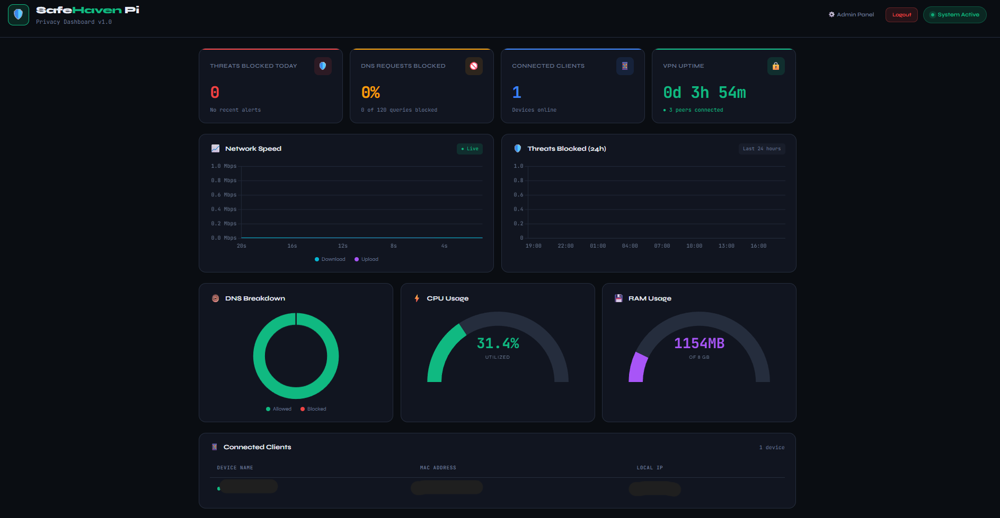
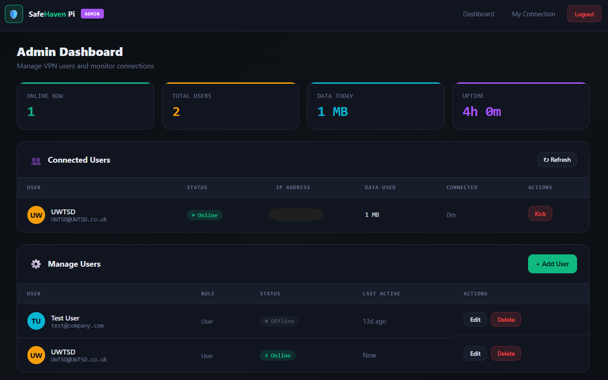
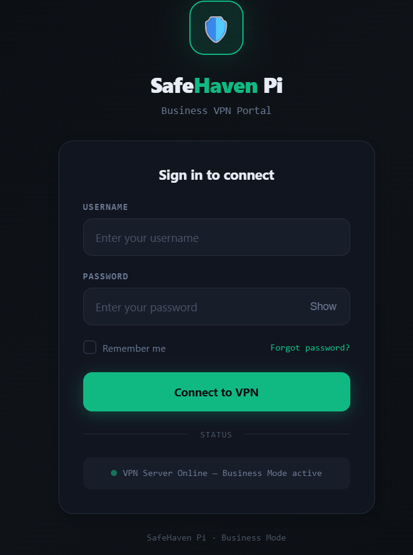
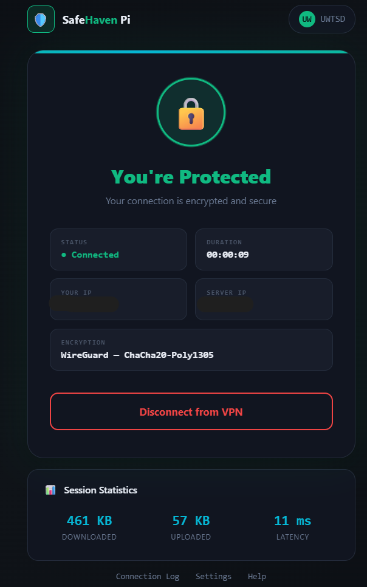

# Business Mode

Business Mode turns SafeHaven Pi into a **secure temporary network with per-user authentication** — designed for shared offices, conferences, pop-up workspaces, and any setting where you need to give multiple people guest WiFi without handing them all the same shared password.

This document covers what it does, when to use it, how to set it up, and how to run it day-to-day from both the **admin** and **end-user** sides.

---

## What it is in one paragraph

When Business Mode is active, the SafeHaven Pi hotspot becomes a captive-portal network: anyone connecting to the WiFi sees a login page (`/portal`) before they can reach the internet. Each guest authenticates with their own credentials, the admin sees who's connected at any time, and admin-level access to the dashboard is gated by a separate admin login. End-user credentials and admin credentials are isolated — guests cannot see the admin panel.

Underneath, the same eight security layers as the other modes are still active (firewall, VPN, DNS filtering, intrusion detection, brute-force protection, honeypot). Business Mode adds the captive-portal layer and the user-management layer on top.

---

## When to use it

| Scenario | Why Business Mode fits |
|---|---|
| Shared / pop-up office | Each tenant gets their own credentials, can be revoked individually |
| Conference or meetup | Per-attendee accounts, audit log of who connected when |
| Cafe-style guest WiFi (back-of-house variant) | Track usage without handing out a shared password |
| Short-term consultancy on a client's site | Bring your own secure hotspot, give the client team their own logins |

When **not** to use it: if you're the only user (use Traveler or Relaxed mode), or if you need maximum anonymity (use Activist mode — Business Mode logs sessions by design).

---

## How Business Mode differs from the other modes

| Feature | Traveler / Activist / Relaxed | **Business** |
|---|---|---|
| Captive portal | Off | **On** at `/portal` |
| End-user authentication | Open hotspot (WPA2 only) | **Per-user login** required |
| Admin dashboard access | Open to anyone on the hotspot | **Gated by admin login** |
| Per-user audit log | No | **Yes** |
| Three HTML pages | — | Login page, post-login confirmation, admin user-management |
| Underlying security stack | Identical 8 layers | Identical 8 layers |
| Use case | Personal or small-team trusted | Multi-user, shared, accountable |

---

## Setup — one-time, before first use

These steps only need to be done once per Pi.

### 1. Install dependencies

If you haven't already, run the main installer:

```bash
sudo bash install.sh
```

This installs Flask, the security stack, and creates the `/etc/safehaven/` data directory.

### 2. Set the admin password

Business Mode separates **admin** credentials (controls the dashboard and user management) from **end-user** credentials (controls hotspot access). Set the admin password first:

```bash
sudo python3 app.py --set-admin-password
```

You'll be prompted to enter and confirm a password. It's stored as a salted hash in `/etc/safehaven/auth.json` — never in plain text.

### 3. Generate the HTTPS certificate

The captive portal and admin panel are served over HTTPS with a self-signed certificate:

```bash
sudo mkdir -p /etc/safehaven/ssl
sudo openssl req -x509 -newkey rsa:4096 -nodes \
  -keyout /etc/safehaven/ssl/key.pem \
  -out /etc/safehaven/ssl/cert.pem \
  -days 365 -subj "/CN=SafeHaven-Pi/O=SafeHaven/C=GB"
sudo chmod 600 /etc/safehaven/ssl/key.pem
```

Browsers will warn once about the self-signed cert — that's expected. End-users on the captive portal will see the same warning the first time they connect.

### 4. Confirm the Flask service is running

The dashboard runs as `safehaven-dashboard.service`:

```bash
sudo systemctl enable safehaven-dashboard
sudo systemctl start safehaven-dashboard
sudo systemctl status safehaven-dashboard
```

If it shows `active (running)`, you're ready to switch into Business Mode.

---

## Activating Business Mode

From the main menu (`sudo bash safehaven.sh`), press `[3]` for Business Mode. You'll see:

```
Switching on Business Mode
Secure temporary network with per-user authentication and admin panel.

Starting WiFi hotspot...                 ✓  Hotspot broadcasting
Starting DHCP server...                  ✓  DHCP active
Starting firewall...                     ✓  Firewall active
Starting DNS filter...                   ✓  Pi-hole active
Starting threat detection...             ✓  Suricata + Fail2ban active
Activating captive portal...             ✓  Portal live at /portal
Gating admin dashboard...                ✓  Login required in Business Mode

✓  Business Mode is active.

End-user captive portal:  https://10.42.0.1:5000/portal
```

The Pi is now broadcasting the SafeHaven hotspot in Business Mode. Anyone who connects will be redirected to the captive portal and asked to log in.

---

## Admin walkthrough

### Logging in as admin

1. Connect a device to the SafeHaven hotspot (you, the admin)
2. Open `https://10.42.0.1:5000/login` in any browser
3. Enter the admin password you set during setup
4. You'll land on the dashboard



### Managing users

Navigate to `https://10.42.0.1:5000/admin/users` (or click "Users" from the dashboard).



The user-management page lets you:

| Action | Endpoint | What it does |
|---|---|---|
| **List users** | `GET /admin/api/users` | Shows every user, when they last connected, their current session status |
| **Add a user** | `POST /admin/api/users` | Create a new user with a username and password |
| **Remove a user** | `DELETE /admin/api/users/<username>` | Delete a user account permanently |
| **See who's connected now** | `GET /admin/api/connected` | Live list of users currently on the hotspot |
| **Kick a user** | `POST /admin/api/kick/<username>` | Terminate a user's session immediately |

User credentials are stored at `/etc/safehaven/business-users.json` as salted hashes (never plaintext).

### Day-to-day admin tasks

- **Adding new attendees before an event:** create accounts via the admin panel; share the credentials with each attendee privately
- **Removing access at end of event:** delete the user account, or revoke all accounts at once via Factory Reset (menu option `[f]`)
- **Investigating issues:** the admin panel shows who's currently connected and the audit log shows when each user last logged in

---

## End-user walkthrough

### Connecting

1. Find the SafeHaven WiFi network on your phone or laptop
2. Connect using the WPA2 password (the hotspot password, set in the Setup Wizard)
3. Your device will detect the captive portal and redirect to `https://10.42.0.1:5000/portal`
4. Enter the username and password the admin gave you



5. Once authenticated, you have internet access through the SafeHaven Pi's full security stack

### What you'll see after login



`https://10.42.0.1:5000/portal/connected` shows your post-login status:

- Connection state (active / inactive)
- Username you're connected as
- Time you connected
- Disconnect button (ends your session)

### Disconnecting

Either:
- Click "Disconnect" on the post-login page (`/portal/connected`)
- Or simply disconnect from the WiFi — your session expires when the device leaves

If the admin kicks your session, you'll be returned to the login page on your next page load.

---

## Commands reference

| Command | Purpose |
|---|---|
| `sudo python3 app.py --set-admin-password` | Set or change the admin password |
| `sudo bash safehaven.sh` then press `[3]` | Switch into Business Mode |
| `sudo bash safehaven.sh` then press `[1]` | Leave Business Mode (back to Traveler) |
| `sudo bash safehaven.sh` then press `[s]` | Stop all services (deactivates Business Mode) |
| `sudo bash safehaven.sh` then press `[f]` | Factory Reset — wipes all Business users and admin password |
| `sudo systemctl restart safehaven-dashboard` | Restart the Flask service if the portal becomes unresponsive |
| `sudo journalctl -u safehaven-dashboard -f` | Tail the Flask service log for debugging |

---

## Files reference

These files are written and managed by the Pi during Business Mode operation:

| File | Purpose |
|---|---|
| `/etc/safehaven/auth.json` | Hashed admin credentials |
| `/etc/safehaven/business-users.json` | Hashed end-user credentials |
| `/etc/safehaven/secret.key` | Flask session signing key |
| `/etc/safehaven/ssl/cert.pem` | HTTPS certificate (self-signed) |
| `/etc/safehaven/ssl/key.pem` | HTTPS private key |
| `/tmp/safehaven-mode` | Marker file recording the active mode |

**None of these files are committed to the repository.** They're generated locally on each Pi.

---

## Privacy in Business Mode

Business Mode is the only mode where SafeHaven Pi keeps a per-user audit log. This is by design — accountability is the whole point of business-context guest WiFi — but it's a different posture from the other modes.

What's logged:
- When each user logged in
- Username (no plaintext password — only the hash is stored)
- Session start and end timestamps
- Last connection time

What's **not** logged:
- The contents of any traffic
- Which sites users visited (DNS queries are filtered by Pi-hole but not attributed to individual users)
- Anything outside the captive-portal session itself

If you need a fully no-logs posture for sensitive sessions, switch to Activist Mode instead.

---

## Troubleshooting

### Captive portal doesn't appear when I connect

- Confirm Business Mode is active: run `cat /tmp/safehaven-mode` — you should see `3:Business Mode:...`
- Check that the Flask service is running: `sudo systemctl status safehaven-dashboard`
- On some devices, manually visit `http://10.42.0.1:5000/portal` after connecting

### Admin login fails

- Verify the admin password was set: `sudo python3 app.py --set-admin-password` (re-runs the prompt)
- Check the auth file exists and is readable: `sudo ls -l /etc/safehaven/auth.json`

### Created a user but they can't log in

- Check the user was actually saved: `sudo cat /etc/safehaven/business-users.json` (you'll see the entry, hashed)
- Make sure they're entering the username exactly as you typed it — usernames are case-sensitive

### "Connection not secure" warning in the browser

- This is expected — the HTTPS certificate is self-signed. Click "Advanced" → "Proceed" once, and the browser will remember
- If you want to silence it permanently for an internal deployment, install your own CA-signed certificate at `/etc/safehaven/ssl/cert.pem`

For a wider list of SafeHaven Pi failure modes and fixes, see [`TROUBLESHOOTING.md`](TROUBLESHOOTING.md).

---

## Limitations of Business Mode in v1.0-alpha

Honest scope of what this version of Business Mode does and doesn't do:

- **Per-user WireGuard provisioning is not yet wired in.** The captive portal authenticates users for hotspot access; it doesn't yet hand each user their own WireGuard tunnel. All Business-mode users currently share the Pi's outbound VPN tunnel.
- **No role-based access control on the admin side.** It's binary: you have the admin password or you don't. Multi-admin with permission tiers is roadmap (see [`KNOWN_ISSUES.md`](KNOWN_ISSUES.md)).
- **No usage quotas or bandwidth caps.** Connected users have full access to the Pi's outbound bandwidth.
- **Sessions reset if the Flask service restarts.** Connected-user state is in-memory; a `systemctl restart safehaven-dashboard` will require everyone to log in again.

These are documented honestly so admins can plan around them.

---

## Returning to single-user modes

Switching back to Traveler / Activist / Relaxed mode automatically deactivates the captive portal and unlocks the dashboard for direct access. Existing Business user accounts are preserved in `/etc/safehaven/business-users.json` — they're inactive while in single-user mode but immediately available the next time you switch back to Business.

To wipe them, use Factory Reset (menu option `[f]`).

---

*See [`README.md`](README.md) for the project overview, [`KNOWN_ISSUES.md`](KNOWN_ISSUES.md) for the full v1 limitations list, and [`SECURITY.md`](SECURITY.md) for how to report security concerns.*
