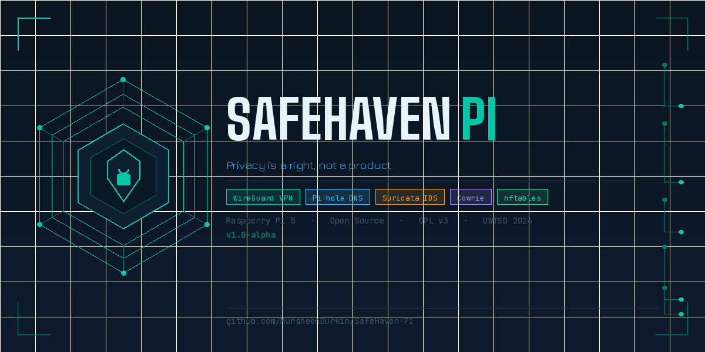
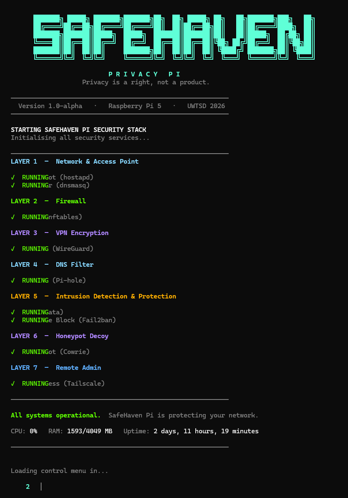
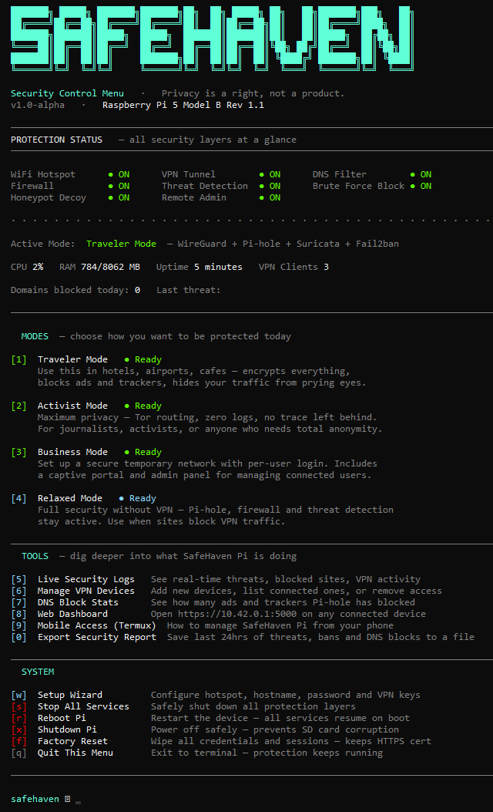
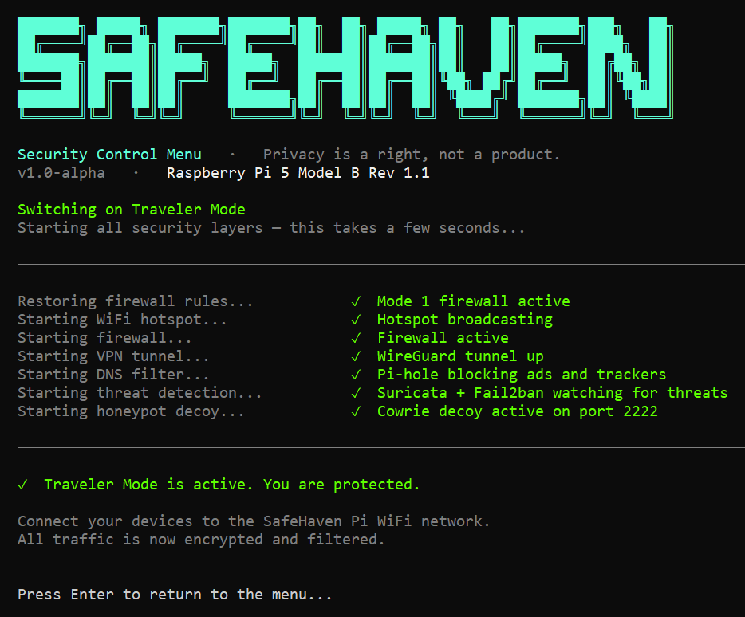
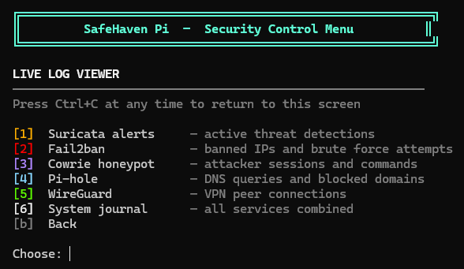

# SafeHaven Pi




> **Privacy is a right, not a product.**

A portable, open-source network security device built on a Raspberry Pi 5. Connect any device to its hotspot and your traffic is automatically encrypted, filtered, and monitored — no apps, no subscriptions, no trust required.

---

## What it does

SafeHaven Pi runs seven security layers simultaneously the moment you connect:

| Layer | Service | What it does |
|-------|---------|-------------|
| 1 | **hostapd** | Creates a WPA3-encrypted WiFi hotspot |
| 2 | **nftables** | Firewall — blocks and routes all traffic |
| 3 | **WireGuard** | Encrypts all traffic through a VPN tunnel |
| 4 | **Pi-hole** | DNS filter — strips ads, trackers, malware domains |
| 5 | **Suricata** | Intrusion detection — 48,781 threat signatures |
| 5 | **Fail2ban** | Brute force protection — auto-bans repeat attackers |
| 6 | **Cowrie** | SSH honeypot — lures and logs attackers on port 2222 |

---

## Quick Start

### 1. Clone the repository

```bash
git clone https://github.com/MursheenDurkin/SafeHaven-PI.git
cd safehaven-pi
```

### 2. Run the installer (once)

```bash
sudo bash install.sh
```

This installs all dependencies, configures services, and registers the `safehaven` command system-wide. Takes 3–5 minutes.

### 3. Start SafeHaven Pi

```bash
sudo safehaven
```

That's it. You'll see the boot sequence start each security layer with a live status indicator, then the control menu loads automatically.

---

## The Control Menu

```
  ╔══════════════════════════════════════════════════════════╗
  ║         SafeHaven Pi  —  Security Control Menu          ║
  ╚══════════════════════════════════════════════════════════╝

  SYSTEM STATUS
  ──────────────────────────────────────────────────────────
  WiFi Hotspot        ● RUNNING    Suricata IDS    ● RUNNING
  WireGuard VPN       ● ACTIVE     Fail2ban        ● RUNNING
  Pi-hole DNS         ● RUNNING    Cowrie Honeypot ● RUNNING
  Firewall (nftables) ● RUNNING    Tailscale       ● RUNNING
  ──────────────────────────────────────────────────────────
  CPU: 12%  |  RAM: 847/4096 MB  |  Uptime: 2 hours  |  VPN Clients: 1

  MODES
  [1]  Traveler Mode    ● Ready   Encrypted hotspot + VPN + full security
  [2]  Activist Mode    ◐ Soon    Privacy-first + Tor + zero-log DNS
  [3]  Business Mode    ◐ Soon    Secure LAN + client isolation

  TOOLS
  [4]  View live logs
  [5]  WireGuard QR code
  [6]  Pi-hole DNS stats
  [7]  Open dashboard

  SYSTEM
  [s]  Stop all services
  [r]  Reboot
  [q]  Quit menu
```

---

## Operating Modes

### Mode 1 — Traveler ✅ Complete
For anyone using public WiFi. Encrypts all traffic through WireGuard, filters DNS through Pi-hole, monitors for intrusions with Suricata. Connect and you're protected.

### Mode 2 — Activist / Journalist 🚧 In Progress
Privacy-first configuration. Adds Tor routing, enables zero-log DNS, and disables all traffic logging. For situations where source protection is critical.

### Mode 3 — Business 🚧 Planned
Secure temporary LAN for conferences or remote work. Adds multi-client traffic isolation and a business-focused dashboard view.

---

## Dashboard

The Flask web dashboard is accessible at `http://10.42.0.1:5000` on any device connected to the SafeHaven hotspot. It shows:

- Threats blocked (live from Suricata)
- DNS queries blocked % (Pi-hole API)
- Connected clients (dnsmasq + WireGuard)
- VPN uptime
- CPU / RAM gauges
- Network speed graph
- Threats per hour chart

---

## Requirements

- Raspberry Pi 5 (recommended) or Pi 4
- Two network interfaces (built-in WiFi + USB adapter, or built-in + ethernet)
- Raspberry Pi OS (64-bit, Bookworm)
- Internet connection for initial setup

---

## Project Structure

```
safehaven-pi/
├── install.sh              ← Run once after cloning
├── safehaven.sh            ← Main startup script (sudo safehaven)
├── safehaven_menu.sh       ← Standalone menu (called by safehaven.sh)
├── configs/
│   ├── hostapd.conf        ← WiFi hotspot configuration
│   ├── dnsmasq.conf        ← DHCP and DNS configuration
│   ├── wg0.conf            ← WireGuard VPN configuration
│   └── nftables.conf       ← Firewall ruleset
├── scripts/
│   ├── startup.sh          ← Service startup with ordering
│   ├── mode1.sh            ← Traveler mode
│   ├── mode2.sh            ← Activist mode
│   └── mode3.sh            ← Business mode
└── dashboard/
    ├── app.py              ← Flask backend
    ├── templates/
    └── static/
```

---

## Built With

- [WireGuard](https://www.wireguard.com/) — VPN
- [Pi-hole](https://pi-hole.net/) — DNS filtering
- [Suricata](https://suricata.io/) — Intrusion detection
- [Fail2ban](https://www.fail2ban.org/) — Brute force protection
- [Cowrie](https://github.com/cowrie/cowrie) — SSH honeypot
- [Flask](https://flask.palletsprojects.com/) — Dashboard
- [Tailscale](https://tailscale.com/) — Remote admin access

---

## Academic Context

SafeHaven Pi is a final-year project for BSc Computer Networks and Cybersecurity at UWTSD (2025–2026), submitted as part of the ACCB6019 Emerging Trends module. The project demonstrates practical implementation of open-source security tooling on constrained hardware, with a focus on accessibility and post-quantum readiness.

---

## Licence

- [GitHub Repository](https://github.com/MursheenDurkin/SafeHaven-PI)

---

## Screenshots

### Boot sequence — services starting up


### Main control menu


### Mode 1 — Traveler Mode activating


### Live log viewer


---
